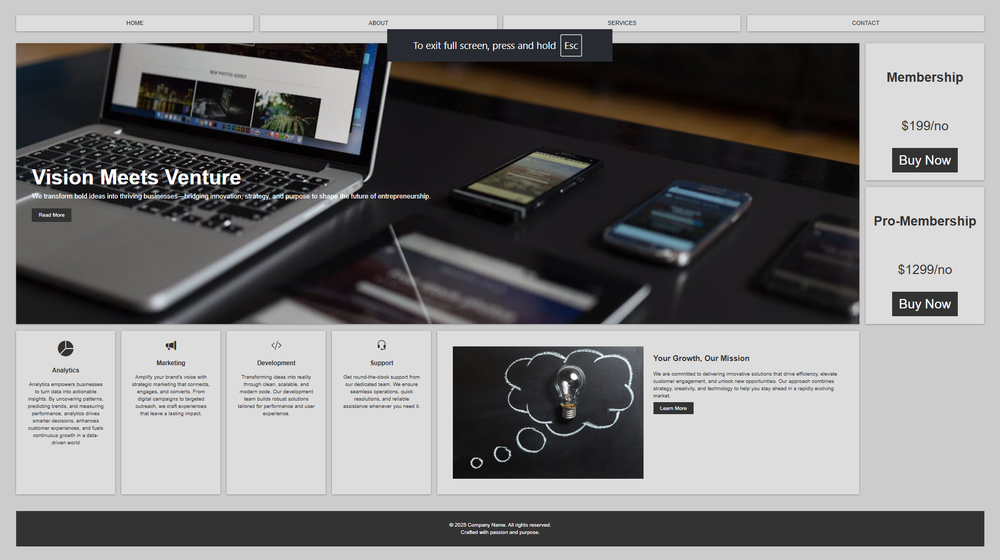

# 💼 Business Grid Website

A **responsive and modern business landing page** crafted using HTML and CSS. The layout uses **CSS Grid and Flexbox** to deliver a clean, professional design — perfect for showcasing services, pricing, and brand vision.

---
## 📸 Website Preview

### 🖼️ Screenshot

 

---

## 🚀 Features

- 🔹 Fully responsive layout
- 🔹 Grid-based sectioning for clean structure
- 🔹 Navigation menu with hover effects
- 🔹 Showcase section with background image
- 🔹 Pricing boxes (Membership & Pro-Membership)
- 🔹 4 service boxes: Analytics, Marketing, Development, Support
- 🔹 Informative "About Us" style section
- 🔹 Dark footer with branding

---

## 🛠️ Tech Stack

- **HTML5**
- **CSS3**
- **CSS Grid**
- **Flexbox**
- **Bootstrap Icons**
- **Font Awesome (via CDN)**

---

## 📁 Folder Structure

Business-Grid/
│
├── index.html
├── style.css
├── img/
│ ├── img1.jpg
│ ├── img2.jpg
│ ├── screenshot.png

---

## ⚙️ Installation & Usage

### 🔄 Clone the repository

git clone https://github.com/sucharita-g/business-grid-website.git
cd business-grid-website

## 🎨 Customization

💬 Change content in index.html to reflect your brand.

🎨 Update colors via CSS variables in style.css (:root section).

🖼️ Replace images in the img/ folder.

✨ Add more icons using Bootstrap Icons or Font Awesome.

## 🤝 Contributing

Contributions are welcome!
If you have ideas or improvements, feel free to:

Fork the project

Create a branch

Submit a pull request

## ⭐ Show your support
If you like this project, consider giving it a ⭐ on GitHub and sharing it with your friends!
